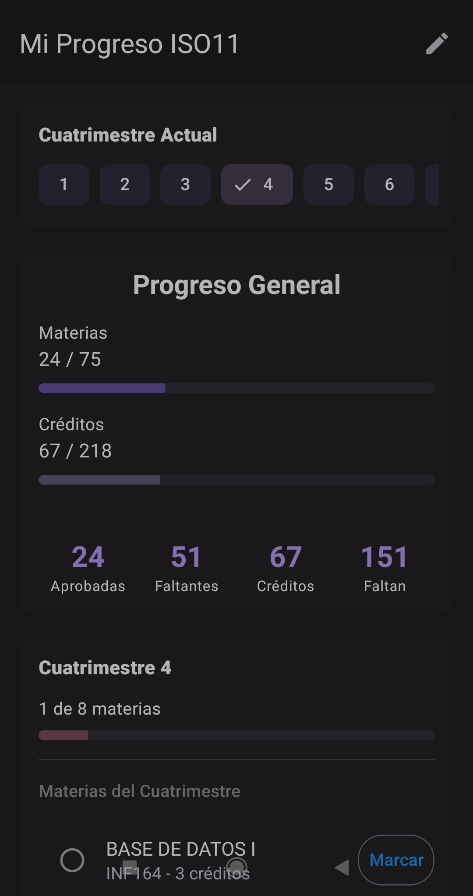
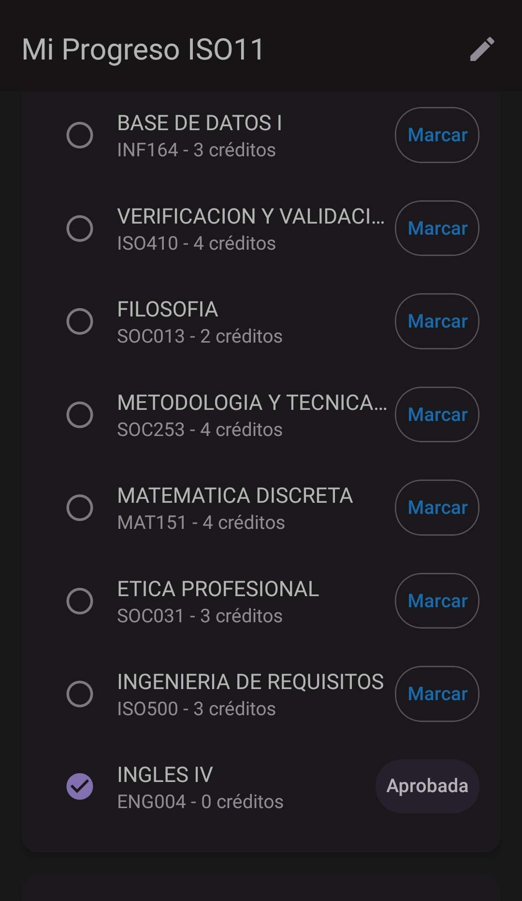
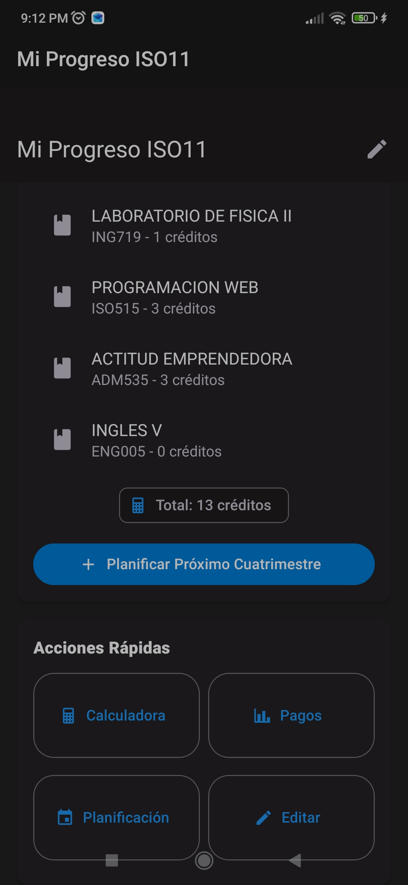

# ISO11 - Gestor de Pensum Universitario


**ISO11** es una aplicación móvil desarrollada con React Native y Expo, diseñada específicamente para los estudiantes de Ingeniería de Software de la Universidad APEC (UNAPEC). Su objetivo es facilitar la administración del pensum académico, permitiendo un seguimiento personalizado de las materias cursadas y una planificación inteligente de los próximos cuatrimestres, respetando los prerrequisitos establecidos por la universidad.

---

## Funcionalidades principales

- **Gestión completa del pensum**: Agrega, edita y elimina asignaturas según tu avance personal.
- **Control de materias aprobadas**: Marca las materias que ya has cursado y aprobado, y visualiza tu progreso general.
- **Planificación automática**: La app calcula automáticamente qué materias puedes cursar en el próximo cuatrimestre, basándose en los prerrequisitos que ya has cumplido.
- **Cálculo de duración restante**: Estima el número de cuatrimestres necesarios para completar la carrera, considerando las materias pendientes.
- **Interfaz intuitiva y amigable**: Diseño limpio y fácil de navegar, adaptado a dispositivos móviles.

---

## Tecnologías utilizadas

- **React Native** (con Expo) para el desarrollo multiplataforma (iOS y Android).
- **AsyncStorage** para el almacenamiento local persistente de los datos del pensum.
- **React Navigation** para la navegación entre pantallas (stack, tabs, etc.).
- **Context API** para la gestión del estado global de la aplicación.
- **JavaScript (ES6+)** como lenguaje principal.
- **Inteligencia Artificial** como herramienta de desarrollo.

---

## Capturas de pantalla

| Progreso General  | Lista de materias  | Herramientas |
|-------------------|--------------------|-------------------|
|  |  |  |

---

## Cómo probar la aplicación

### Opción 1: Descargar el APK (solo Android)

Puedes descargar la última versión de la aplicación desde la sección [Releases](https://github.com/marvin-ramirez/ISO11/releases) de este repositorio. Busca el archivo `.apk` e instálalo en tu dispositivo Android (recuerda habilitar la instalación desde orígenes desconocidos).

### Opción 2: Ejecutar en entorno de desarrollo

Si deseas explorar el código o ejecutar la app en tu propio entorno:

1. Clona este repositorio:
   ```bash
   git clone https://github.com/marvin-ramirez/ISO11.git

2. Accede a la carpeta del proyecto:
   ```bash
   cd ISO11

3. Instala las dependencias:
   ```bash
   npm install

4. Inicia el proyecto con Expo:
   ```bash
   expo start

5. Escanea el código QR con la aplicación Expo Go en tu dispositivo iOS o Android.
